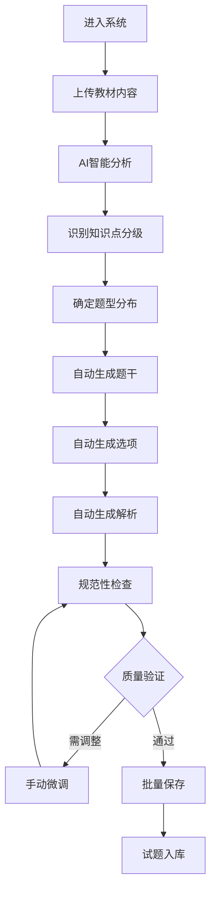

# HR搏学AI自动命题系统产品需求文档

## 1. 产品概述

HR搏学AI自动命题系统是一个基于人工智能的智能命题平台，用户只需输入教材材料，系统即可基于《第五届HR搏学命题要求规范》自动生成符合标准的试题，并智能识别知识点分级（HR掌握、全员掌握、全员熟悉、全员了解）。系统通过AI算法确保生成的试题在题干、选项、解析等方面完全符合规范要求，实现"一键生成，标准输出"的目标。

## 2. 核心特性

### 2.1 系统特点

* **AI智能生成**：基于教材内容自动生成标准化试题

* **智能分级识别**：自动识别并标注知识点分级

* **规范严格遵循**：完全按照《第五届HR搏学命题要求规范》生成试题

* **一键批量生成**：支持批量处理教材内容，快速生成大量试题

### 2.2 功能模块

系统包含以下核心页面：

1. **教材输入页面**：教材内容上传、文本输入、批量处理
2. **AI生成工作台**：智能分析、自动命题、实时预览
3. **试题审核页面**：生成结果查看、手动调整、质量确认
4. **题库管理页面**：试题查询、分类管理、批量导出

### 2.3 页面详情

| 页面名称     | 模块名称     | 功能描述                                   |
| -------- | -------- | -------------------------------------- |
| 教材输入页面   | 内容上传     | 支持文档上传（PDF、Word、TXT）、文本直接输入、批量文件处理 |
| 教材输入页面   | 智能预处理    | 自动识别教材结构、提取关键知识点、预判知识分级              |
| AI生成工作台  | 智能分析引擎   | 基于规范要求分析教材内容、识别考点、确定题型分布             |
| AI生成工作台  | 自动命题引擎   | 按规范自动生成题干、选项、解析，确保格式和内容标准            |
| AI生成工作台  | 实时预览     | 生成过程可视化、试题实时预览、批量生成进度显示              |
| 试题审核页面   | 质量检查     | 自动检查生成试题的规范性、逻辑性、完整性                 |
| 试题审核页面   | 手动调整     | 支持对生成试题进行微调、修改、完善                    |
| 题库管理页面   | 智能分类     | 按知识点分级、题型、难度等自动分类管理                  |
| 题库管理页面   | 批量导出     | 支持多种格式导出（Excel、Word、JSON）、自定义导出规则   |

## 3. 核心流程

### AI自动命题流程

## 4. 用户界面设计

### 4.1 设计风格

* **主色调**：专业蓝色 (#2563EB) 和辅助灰色 (#64748B)

* **按钮样式**：圆角矩形，悬停效果，主要按钮使用渐变色

* **字体**：系统默认字体，标题16px，正文14px，说明文字12px

* **布局风格**：左侧导航 + 主内容区域，卡片式设计，响应式布局

* **图标风格**：线性图标，统一风格，支持主题色彩

### 4.2 页面设计概览

| 页面名称     | 模块名称   | UI元素                     |
| -------- | ------ | ------------------------ |
| 教材输入页面   | 文件上传区  | 拖拽上传区域、文件格式提示、批量上传进度条    |
| 教材输入页面   | 文本输入区  | 大文本框、字数统计、格式化工具、实时预览     |
| AI生成工作台  | 分析状态区  | 进度条、分析结果展示、知识点识别列表       |
| AI生成工作台  | 生成控制区  | 参数设置面板、生成按钮、批量操作选项       |
| AI生成工作台  | 预览展示区  | 试题卡片、实时更新、分级标签、质量评分      |
| 试题审核页面   | 审核列表   | 试题网格、筛选器、批量操作、质量指标显示     |
| 试题审核页面   | 编辑面板   | 试题详情、编辑工具、保存/撤销按钮        |
| 题库管理页面   | 智能筛选   | 多维度筛选器、搜索框、标签云、统计图表      |

### 4.3 响应式设计

系统采用桌面优先设计，支持平板和移动设备访问。主要考虑：

* 桌面端：完整功能体验，多栏布局

* 平板端：适配触摸操作，简化布局

* 移动端：核心功能保留，垂直布局优化

