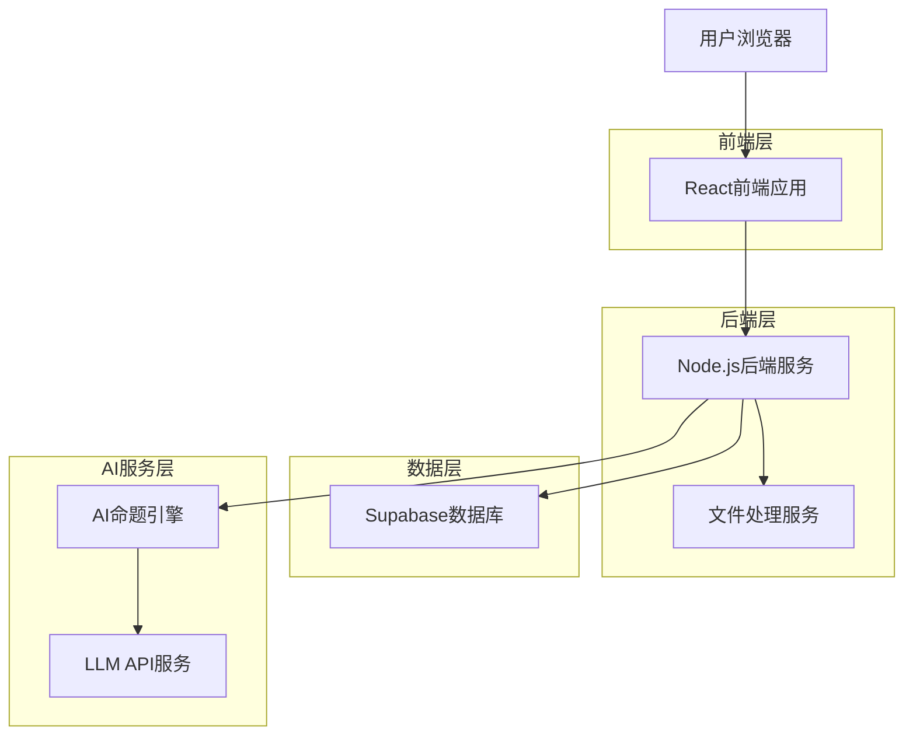
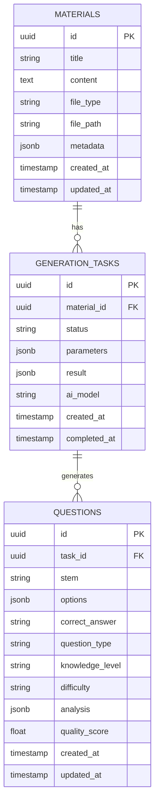

# HR搏学AI自动命题系统技术架构文档

## 1. 架构设计



## 2. 技术描述

* **前端**: React@18 + TypeScript + Tailwind CSS + Vite

* **后端**: Node.js + Express + TypeScript

* **数据库**: Supabase (PostgreSQL)

* **AI服务**: OpenAI GPT-4 / Claude API

* **文件处理**: Multer + PDF解析库

* **部署**: Vercel (前端) + Railway/Render (后端)

## 3. 路由定义

| 路由                | 用途                    |
| ----------------- | --------------------- |
| /                 | 首页，显示系统概览和快速入口        |
| /material-input   | 教材输入页面，上传和输入教材内容      |
| /ai-generator     | AI生成工作台，智能分析和自动命题     |
| /question-review  | 试题审核页面，查看和调整生成的试题     |
| /question-bank    | 题库管理页面，管理和导出生成的试题     |

## 4. API定义

### 4.1 核心API

**教材处理相关**

```
POST /api/materials/upload
POST /api/materials/analyze
GET /api/materials/:id/knowledge-points
```

**AI命题相关**

```
POST /api/ai/generate-questions
GET /api/ai/generation-status/:taskId
POST /api/ai/batch-generate
```

**试题管理相关**

```
GET /api/questions
POST /api/questions
PUT /api/questions/:id
DELETE /api/questions/:id
POST /api/questions/batch-export
```

**AI自动命题API**

```
POST /api/ai/generate-questions
```

请求参数:

| 参数名           | 参数类型   | 是否必需 | 描述                    |
| ------------- | ------ | ---- | --------------------- |
| materialText  | string | true | 教材文本内容                |
| questionCount | number | true | 生成试题数量                |
| questionTypes | array  | true | 题型要求（判断题、单选题、多选题）     |
| difficulty    | string | false| 难度要求（易、中、难）           |

响应:

| 参数名       | 参数类型   | 描述       |
| --------- | ------ | -------- |
| taskId    | string | 生成任务ID   |
| status    | string | 任务状态     |
| questions | array  | 生成的试题列表  |
| metadata  | object | 生成过程元数据  |

示例请求:

```json
{
  "materialText": "岗位价值评估是人力资源管理的重要环节，主要目的是确定不同岗位对组织目标实现的贡献程度...",
  "questionCount": 5,
  "questionTypes": ["单选题", "判断题"],
  "difficulty": "中"
}
```

示例响应:

```json
{
  "taskId": "task_123456",
  "status": "completed",
  "questions": [
    {
      "id": "q_001",
      "type": "单选题",
      "knowledgeLevel": "HR掌握",
      "stem": "以下关于岗位价值评估的说法，哪项是正确的？（ ）",
      "options": [
        "主要考虑岗位稀缺性",
        "以对组织目标的贡献为基础",
        "重点关注员工满意度",
        "依据薪资高低判断"
      ],
      "correctAnswer": "B",
      "analysis": {
        "textbook": "根据《第5届HR搏学考试辅导教材》第82页...",
        "explanation": "岗位价值评估的核心在于...",
        "conclusion": "本题答案为B"
      }
    }
  ],
  "metadata": {
    "generationTime": "2024-01-01T10:00:00Z",
    "aiModel": "gpt-4",
    "qualityScore": 0.95
  }
}
```

## 5. 数据模型

### 5.1 数据模型定义



### 5.2 数据定义语言

**教材表 (materials)**

```sql
-- 创建教材表
CREATE TABLE materials (
    id UUID PRIMARY KEY DEFAULT gen_random_uuid(),
    title VARCHAR(200) NOT NULL,
    content TEXT NOT NULL,
    file_type VARCHAR(20),
    file_path VARCHAR(500),
    metadata JSONB DEFAULT '{}',
    created_at TIMESTAMP WITH TIME ZONE DEFAULT NOW(),
    updated_at TIMESTAMP WITH TIME ZONE DEFAULT NOW()
);

-- 创建索引
CREATE INDEX idx_materials_title ON materials(title);
CREATE INDEX idx_materials_created_at ON materials(created_at DESC);
```

**生成任务表 (generation_tasks)**

```sql
-- 创建生成任务表
CREATE TABLE generation_tasks (
    id UUID PRIMARY KEY DEFAULT gen_random_uuid(),
    material_id UUID REFERENCES materials(id),
    status VARCHAR(20) NOT NULL DEFAULT 'pending' CHECK (status IN ('pending', 'processing', 'completed', 'failed')),
    parameters JSONB NOT NULL,
    result JSONB DEFAULT '{}',
    ai_model VARCHAR(50),
    created_at TIMESTAMP WITH TIME ZONE DEFAULT NOW(),
    completed_at TIMESTAMP WITH TIME ZONE
);

-- 创建索引
CREATE INDEX idx_generation_tasks_status ON generation_tasks(status);
CREATE INDEX idx_generation_tasks_material ON generation_tasks(material_id);
```

**试题表 (questions)**

```sql
-- 创建试题表
CREATE TABLE questions (
    id UUID PRIMARY KEY DEFAULT gen_random_uuid(),
    task_id UUID REFERENCES generation_tasks(id),
    stem TEXT NOT NULL,
    options JSONB NOT NULL,
    correct_answer VARCHAR(10) NOT NULL,
    question_type VARCHAR(20) NOT NULL CHECK (question_type IN ('判断题', '单选题', '多选题')),
    knowledge_level VARCHAR(20) NOT NULL CHECK (knowledge_level IN ('HR掌握', '全员掌握', '全员熟悉', '全员了解')),
    difficulty VARCHAR(10) DEFAULT '中' CHECK (difficulty IN ('易', '中', '难')),
    analysis JSONB NOT NULL,
    quality_score FLOAT DEFAULT 0.0 CHECK (quality_score >= 0.0 AND quality_score <= 1.0),
    created_at TIMESTAMP WITH TIME ZONE DEFAULT NOW(),
    updated_at TIMESTAMP WITH TIME ZONE DEFAULT NOW()
);

-- 创建索引
CREATE INDEX idx_questions_type ON questions(question_type);
CREATE INDEX idx_questions_knowledge_level ON questions(knowledge_level);
CREATE INDEX idx_questions_task ON questions(task_id);
CREATE INDEX idx_questions_quality_score ON questions(quality_score DESC);
```

**初始化数据示例**

```sql
-- 插入示例教材
INSERT INTO materials (title, content, file_type, metadata) VALUES 
('人力资源管理基础', '人力资源管理是指企业运用现代管理方法，对人力资源的获取、开发、保持和利用等方面所进行的计划、组织、指挥、控制和协调等一系列活动...', 'text', '{"chapter": "第一章", "pages": "1-20"}'),
('绩效管理制度', '绩效管理是一个持续的过程，包括绩效计划、绩效实施、绩效考核和绩效反馈四个环节...', 'pdf', '{"source": "内部培训材料", "version": "2024"}');

-- 插入示例生成任务
INSERT INTO generation_tasks (material_id, status, parameters, ai_model) VALUES 
((SELECT id FROM materials WHERE title = '人力资源管理基础'), 'completed', '{"questionCount": 10, "questionTypes": ["单选题", "判断题"], "difficulty": "中"}', 'gpt-4');

-- 插入示例试题
INSERT INTO questions (task_id, stem, options, correct_answer, question_type, knowledge_level, difficulty, analysis, quality_score) VALUES 
((SELECT id FROM generation_tasks LIMIT 1), '人力资源管理的核心目标是什么？', '{"A": "降低成本", "B": "提高效率", "C": "实现人与组织的共同发展", "D": "增加利润"}', 'C', '单选题', 'HR掌握', '中', '{"explanation": "人力资源管理的核心目标是实现人与组织的共同发展，通过有效的人力资源配置和开发来提升组织绩效。", "knowledge_point": "人力资源管理基本概念"}', 0.95);
```

**权限设置**

```sql
-- 为匿名用户授予完整权限（无需认证）
GRANT ALL PRIVILEGES ON knowledge_points TO anon;
GRANT ALL PRIVILEGES ON questions TO anon;
```

**初始数据**

```sql
-- 插入示例知识点
INSERT INTO knowledge_points (title, description, level, textbook_page) VALUES
('组织设计方法', '组织设计的基本方法和原则', '全员掌握', '第82页'),
('岗位价值评估', '岗位价值评估的原则和方法', 'HR掌握', '第95页');
```

