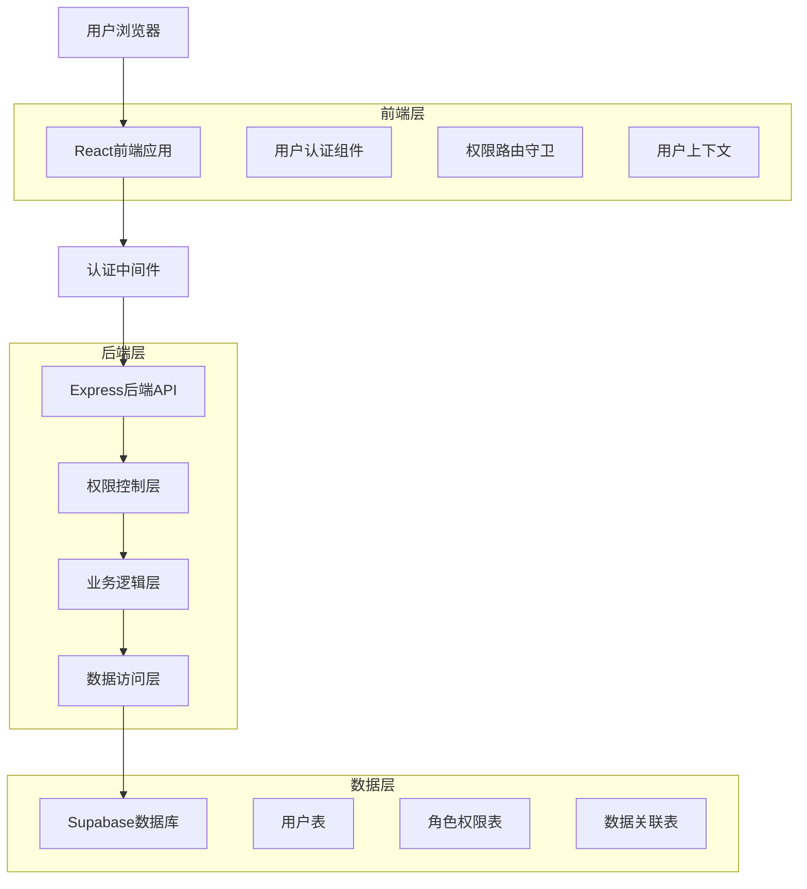
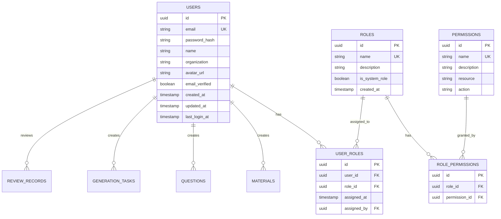

# HR搏学命题系统用户权限管理技术架构文档

## 1. 架构设计



## 2. 技术描述

- 前端：React@18 + TypeScript + Tailwind CSS + React Router + Zustand（状态管理）
- 后端：Express@4 + TypeScript + JWT认证
- 数据库：Supabase（PostgreSQL）+ Row Level Security（RLS）
- 认证：JWT Token + Refresh Token机制
- 权限控制：基于角色的访问控制（RBAC）+ 数据级权限控制

## 3. 路由定义

| 路由 | 用途 | 权限要求 |
|------|------|----------|
| /auth/login | 用户登录页面 | 公开访问 |
| /auth/register | 用户注册页面 | 公开访问 |
| /auth/forgot-password | 忘记密码页面 | 公开访问 |
| /dashboard | 用户工作台首页 | 需要登录 |
| /profile | 个人中心页面 | 需要登录 |
| /my-materials | 我的教材页面 | 需要登录 |
| /my-questions | 我的试题页面 | 需要登录 |
| /my-reviews | 我的审核页面 | 需要登录 |
| /my-question-bank | 我的题库页面 | 需要登录 |
| /admin/users | 用户管理页面 | 管理员权限 |
| /admin/roles | 角色权限配置 | 管理员权限 |
| /review/assigned | 分配的审核任务 | 审核员权限 |

## 4. API定义

### 4.1 用户认证相关API

**用户注册**
```
POST /api/auth/register
```

Request:
| 参数名 | 参数类型 | 是否必填 | 描述 |
|--------|----------|----------|------|
| email | string | true | 用户邮箱 |
| password | string | true | 用户密码（明文，后端加密） |
| name | string | true | 用户姓名 |
| organization | string | false | 所属机构 |

Response:
| 参数名 | 参数类型 | 描述 |
|--------|----------|------|
| success | boolean | 注册是否成功 |
| message | string | 响应消息 |
| user_id | string | 用户ID（成功时返回） |

Example:
```json
{
  "email": "user@example.com",
  "password": "password123",
  "name": "张三",
  "organization": "某某公司"
}
```

**用户登录**
```
POST /api/auth/login
```

Request:
| 参数名 | 参数类型 | 是否必填 | 描述 |
|--------|----------|----------|------|
| email | string | true | 用户邮箱 |
| password | string | true | 用户密码 |
| remember_me | boolean | false | 是否记住登录状态 |

Response:
| 参数名 | 参数类型 | 描述 |
|--------|----------|------|
| success | boolean | 登录是否成功 |
| access_token | string | 访问令牌 |
| refresh_token | string | 刷新令牌 |
| user | object | 用户信息 |
| expires_in | number | 令牌过期时间（秒） |

### 4.2 用户管理相关API

**获取用户信息**
```
GET /api/users/profile
```

**更新用户信息**
```
PUT /api/users/profile
```

**获取用户列表（管理员）**
```
GET /api/admin/users
```

**分配用户角色（管理员）**
```
PUT /api/admin/users/:userId/role
```

### 4.3 权限控制相关API

**检查用户权限**
```
GET /api/auth/permissions
```

**获取角色列表**
```
GET /api/admin/roles
```

## 5. 数据模型

### 5.1 数据模型定义



### 5.2 数据定义语言

**用户表 (users)**
```sql
-- 创建用户表
CREATE TABLE users (
    id UUID PRIMARY KEY DEFAULT gen_random_uuid(),
    email VARCHAR(255) UNIQUE NOT NULL,
    password_hash VARCHAR(255) NOT NULL,
    name VARCHAR(100) NOT NULL,
    organization VARCHAR(200),
    avatar_url TEXT,
    email_verified BOOLEAN DEFAULT FALSE,
    created_at TIMESTAMP WITH TIME ZONE DEFAULT NOW(),
    updated_at TIMESTAMP WITH TIME ZONE DEFAULT NOW(),
    last_login_at TIMESTAMP WITH TIME ZONE
);

-- 创建索引
CREATE INDEX idx_users_email ON users(email);
CREATE INDEX idx_users_created_at ON users(created_at DESC);

-- 启用RLS
ALTER TABLE users ENABLE ROW LEVEL SECURITY;

-- 用户只能查看和修改自己的信息
CREATE POLICY "Users can view own profile" ON users
    FOR SELECT USING (auth.uid() = id);
    
CREATE POLICY "Users can update own profile" ON users
    FOR UPDATE USING (auth.uid() = id);
```

**角色表 (roles)**
```sql
-- 创建角色表
CREATE TABLE roles (
    id UUID PRIMARY KEY DEFAULT gen_random_uuid(),
    name VARCHAR(50) UNIQUE NOT NULL,
    description TEXT,
    is_system_role BOOLEAN DEFAULT FALSE,
    created_at TIMESTAMP WITH TIME ZONE DEFAULT NOW()
);

-- 插入系统默认角色
INSERT INTO roles (name, description, is_system_role) VALUES
('user', '普通用户', TRUE),
('reviewer', '审核员', TRUE),
('admin', '系统管理员', TRUE);
```

**权限表 (permissions)**
```sql
-- 创建权限表
CREATE TABLE permissions (
    id UUID PRIMARY KEY DEFAULT gen_random_uuid(),
    name VARCHAR(100) UNIQUE NOT NULL,
    description TEXT,
    resource VARCHAR(50) NOT NULL,
    action VARCHAR(50) NOT NULL
);

-- 插入系统权限
INSERT INTO permissions (name, description, resource, action) VALUES
('materials.create', '创建教材', 'materials', 'create'),
('materials.read', '查看教材', 'materials', 'read'),
('materials.update', '编辑教材', 'materials', 'update'),
('materials.delete', '删除教材', 'materials', 'delete'),
('questions.create', '创建试题', 'questions', 'create'),
('questions.read', '查看试题', 'questions', 'read'),
('questions.update', '编辑试题', 'questions', 'update'),
('questions.delete', '删除试题', 'questions', 'delete'),
('questions.review', '审核试题', 'questions', 'review'),
('users.manage', '管理用户', 'users', 'manage'),
('system.admin', '系统管理', 'system', 'admin');
```

**用户角色关联表 (user_roles)**
```sql
-- 创建用户角色关联表
CREATE TABLE user_roles (
    id UUID PRIMARY KEY DEFAULT gen_random_uuid(),
    user_id UUID NOT NULL REFERENCES users(id) ON DELETE CASCADE,
    role_id UUID NOT NULL REFERENCES roles(id) ON DELETE CASCADE,
    assigned_at TIMESTAMP WITH TIME ZONE DEFAULT NOW(),
    assigned_by UUID REFERENCES users(id),
    UNIQUE(user_id, role_id)
);

-- 创建索引
CREATE INDEX idx_user_roles_user_id ON user_roles(user_id);
CREATE INDEX idx_user_roles_role_id ON user_roles(role_id);
```

**角色权限关联表 (role_permissions)**
```sql
-- 创建角色权限关联表
CREATE TABLE role_permissions (
    id UUID PRIMARY KEY DEFAULT gen_random_uuid(),
    role_id UUID NOT NULL REFERENCES roles(id) ON DELETE CASCADE,
    permission_id UUID NOT NULL REFERENCES permissions(id) ON DELETE CASCADE,
    UNIQUE(role_id, permission_id)
);

-- 为默认角色分配权限
-- 普通用户权限
INSERT INTO role_permissions (role_id, permission_id)
SELECT r.id, p.id FROM roles r, permissions p 
WHERE r.name = 'user' AND p.name IN (
    'materials.create', 'materials.read', 'materials.update', 'materials.delete',
    'questions.create', 'questions.read', 'questions.update', 'questions.delete'
);

-- 审核员权限
INSERT INTO role_permissions (role_id, permission_id)
SELECT r.id, p.id FROM roles r, permissions p 
WHERE r.name = 'reviewer' AND p.name IN (
    'materials.read', 'questions.read', 'questions.review'
);

-- 管理员权限（所有权限）
INSERT INTO role_permissions (role_id, permission_id)
SELECT r.id, p.id FROM roles r, permissions p 
WHERE r.name = 'admin';
```

**更新现有表结构**
```sql
-- 为现有表添加用户关联
ALTER TABLE materials ADD COLUMN created_by UUID REFERENCES users(id);
ALTER TABLE questions ADD COLUMN created_by UUID REFERENCES users(id);
ALTER TABLE generation_tasks ADD COLUMN created_by UUID REFERENCES users(id);

-- 创建索引
CREATE INDEX idx_materials_created_by ON materials(created_by);
CREATE INDEX idx_questions_created_by ON questions(created_by);
CREATE INDEX idx_generation_tasks_created_by ON generation_tasks(created_by);

-- 为现有表启用RLS
ALTER TABLE materials ENABLE ROW LEVEL SECURITY;
ALTER TABLE questions ENABLE ROW LEVEL SECURITY;
ALTER TABLE generation_tasks ENABLE ROW LEVEL SECURITY;

-- 创建数据访问策略
CREATE POLICY "Users can only see own materials" ON materials
    FOR ALL USING (created_by = auth.uid());
    
CREATE POLICY "Users can only see own questions" ON questions
    FOR ALL USING (created_by = auth.uid());
    
CREATE POLICY "Users can only see own tasks" ON generation_tasks
    FOR ALL USING (created_by = auth.uid());

-- 管理员可以查看所有数据
CREATE POLICY "Admins can see all materials" ON materials
    FOR ALL USING (EXISTS (
        SELECT 1 FROM user_roles ur 
        JOIN roles r ON ur.role_id = r.id 
        WHERE ur.user_id = auth.uid() AND r.name = 'admin'
    ));
```

## 6. 安全机制

### 6.1 认证安全
- 密码使用bcrypt加密存储
- JWT Token有效期设置为24小时
- Refresh Token有效期设置为30天
- 支持Token黑名单机制

### 6.2 权限控制
- 基于Supabase RLS实现数据级权限控制
- API层面进行权限验证
- 前端路由守卫防止未授权访问

### 6.3 数据安全
- 所有敏感数据传输使用HTTPS
- 数据库连接使用SSL加密
- 定期备份用户数据
- 支持数据导出和删除（GDPR合规）