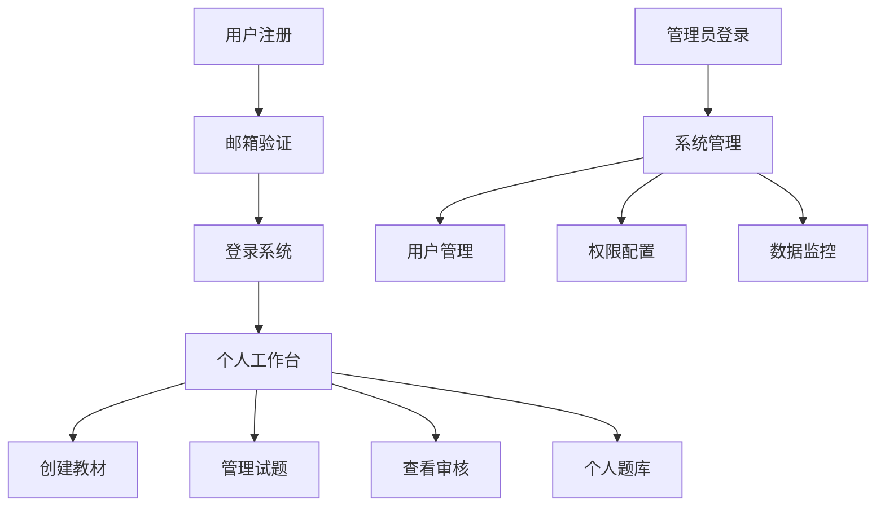

# HR搏学命题系统用户权限管理需求文档

## 1. 产品概述

本文档描述HR搏学命题系统的用户权限管理功能扩展，旨在为系统增加多用户支持、用户认证、权限控制和数据隔离机制。

- 支持多用户注册登录，实现用户身份认证和会话管理
- 提供基于用户的数据隔离，确保用户只能访问自己创建或被授权的内容
- 建立完善的权限控制体系，支持不同用户角色的功能权限管理

## 2. 核心功能

### 2.1 用户角色

| 角色 | 注册方式 | 核心权限 |
|------|----------|----------|
| 普通用户 | 邮箱注册 | 创建和管理自己的教材、试题；查看自己的审核记录和题库 |
| 管理员 | 系统分配 | 管理所有用户数据；系统配置；用户管理；全局数据查看 |
| 审核员 | 邀请注册 | 审核指定用户的试题；查看审核统计；管理审核流程 |

### 2.2 功能模块

系统在现有功能基础上增加以下用户权限相关页面：

1. **用户认证页面**：用户注册、登录、密码重置、个人信息管理
2. **权限控制中心**：用户角色管理、权限分配、数据访问控制
3. **个人工作台**：用户专属的教材管理、试题管理、审核记录查看
4. **系统管理页面**：用户管理、角色配置、系统监控（仅管理员可见）

### 2.3 页面详情

| 页面名称 | 模块名称 | 功能描述 |
|----------|----------|----------|
| 用户注册页面 | 用户注册表单 | 邮箱注册、密码设置、基本信息填写、邮箱验证 |
| 用户登录页面 | 登录表单 | 邮箱密码登录、记住登录状态、忘记密码链接 |
| 个人中心页面 | 个人信息管理 | 查看和编辑个人信息、修改密码、查看账户统计 |
| 我的教材页面 | 教材管理 | 创建、编辑、删除自己的教材；查看教材使用统计 |
| 我的试题页面 | 试题管理 | 管理自己创建的试题；查看试题审核状态；编辑试题内容 |
| 我的审核页面 | 审核记录 | 查看自己提交的试题审核记录；查看审核反馈 |
| 我的题库页面 | 题库管理 | 查看自己创建的已通过审核的试题；导出题库 |
| 用户管理页面 | 用户列表管理 | 查看所有用户、编辑用户信息、分配角色、禁用用户（管理员） |
| 权限配置页面 | 权限设置 | 配置角色权限、设置数据访问规则（管理员） |

## 3. 核心流程

### 普通用户流程
用户注册 → 邮箱验证 → 登录系统 → 创建教材 → AI生成试题 → 提交审核 → 查看审核结果 → 管理个人题库

### 审核员流程
登录系统 → 查看待审核试题列表 → 选择试题进行审核 → 提供审核意见 → 通过或拒绝试题 → 查看审核统计

### 管理员流程
登录系统 → 用户管理 → 角色分配 → 权限配置 → 系统监控 → 数据统计分析

## 4. 用户界面设计

### 4.1 设计风格
- 主色调：蓝色系（#3B82F6）和灰色系（#6B7280）
- 按钮样式：圆角按钮，支持悬停效果
- 字体：系统默认字体，标题16px，正文14px，说明文字12px
- 布局风格：卡片式布局，顶部导航栏，左侧菜单（登录后）
- 图标风格：使用Lucide图标库，简洁现代风格

### 4.2 页面设计概览

| 页面名称 | 模块名称 | UI元素 |
|----------|----------|--------|
| 用户注册页面 | 注册表单 | 居中卡片布局、邮箱输入框、密码强度提示、注册按钮、登录链接 |
| 用户登录页面 | 登录表单 | 居中卡片布局、邮箱密码输入、记住我选项、登录按钮、注册链接 |
| 个人中心页面 | 信息展示 | 头像上传、基本信息表单、统计卡片、操作按钮组 |
| 导航栏 | 用户菜单 | 用户头像、下拉菜单、退出登录、角色标识 |
| 侧边栏 | 功能菜单 | 折叠式菜单、图标+文字、权限控制显示 |

### 4.3 响应式设计
- 桌面优先设计，支持移动端适配
- 断点设置：768px（平板）、1024px（桌面）
- 移动端侧边栏改为抽屉式设计
- 表格在小屏幕下支持横向滚动